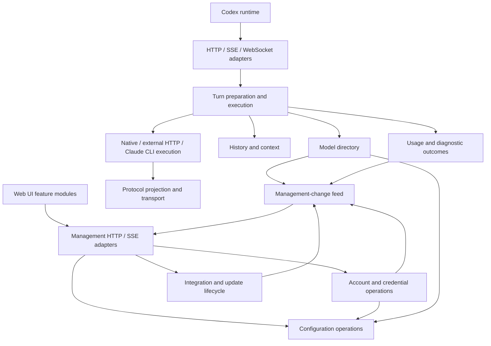

# Architecture assessment and refactoring direction

Assessment date: 2026-10-04. The findings describe the 0.12.9 source plus the
local profiling changes. The first ownership pass is implemented locally.
The continuation below deepens external request execution and error presentation.
This review traced application workflows and inspected all nine crate manifests;
it is not a line-by-line security audit or new cross-platform acceptance run.

## Decision

Redesign application ownership incrementally. Retain the existing protocol,
history, transport and integration implementations behind their useful
interfaces. A replacement of the entire backend is not justified by this review.

The main problem is knowledge shared across callers: handlers know credential
hydration, route selection, history preparation, configuration locking and
notification mechanics. Moving these functions into more files would leave
that problem intact. A successful refactor makes a caller know fewer rules.

The design reference is [Codebase Design](https://github.com/mattpocock/skills/tree/main/skills/engineering/codebase-design).
Use small interfaces that hide substantial behavior; test through those
interfaces. Evaluate an abstraction by what deleting it would force its callers
to implement. File length is a navigation signal, not a measure of module depth.

## Existing structure worth retaining

| Module | Existing responsibility | Decision |
| --- | --- | --- |
| `emp-core` | Route identities, bounded opaque model/provider data, capability views | Retain; preserve unknown fields |
| `emp-protocol` | Responses, Chat and Anthropic projections and stream state | Retain protocol-specific state machines |
| `emp-history` | History preparation, tool pairing, context and compaction algorithms | Retain the `HistoryReader` interface and pure algorithms |
| `emp-transport` | HTTP pools, proxy/TLS policy, admission, framing and WebSocket pump | Retain; profile resource ownership before changing execution model |
| `emp-router` | Protocol selection, projection and upstream execution | Retain; consolidate application attempt orchestration above it |
| `emp-codex` | Codex catalogs, concrete history access, quota helpers and runtime discovery | Retain concrete Codex integration; reduce application callers' knowledge of its storage details |
| `emp-integration` | Configuration leases, conflict detection and recovery | Retain transactional ownership |
| `emp-state` | Configuration, vault, transactions, plus update/usage/diagnostic subsystems | Narrow application access first; do not create new crates merely to redistribute files |
| `emp-app` | Composition, HTTP/UI, request orchestration and mutable services | Primary refactoring target |

No library crate depends on `emp-app`. The principal layering leaks are inside
the application, where most modules can access the complete `ServerState`.

## Findings

### 1. Request preparation and external attempts have explicit owners

[`api/responses.rs`](../crates/emp-app/src/api/responses.rs),
[`api/websocket.rs`](../crates/emp-app/src/api/websocket.rs) and
[`api/compact.rs`](../crates/emp-app/src/api/compact.rs) now use
[`request_preparation.rs`](../crates/emp-app/src/services/request_preparation.rs)
for one request-local configuration, credential hydration, route selection and
summary policy. History/context preparation and transport presentation remain
at their existing boundaries.

[`external.rs`](../crates/emp-app/src/services/external.rs) now owns complete
Responses execution and stream opening. The two operations share a private
attempt implementation: candidate selection, retry bounds/delay, context-error
feedback and retry receipts no longer live in the HTTP adapter. Complete
execution owns one outcome and its activity guard; an opened stream transfers
completion accounting to its existing relay. Optional disconnect monitoring
replaces the two previous opening wrappers and duplicated SSE caller branches.

Its interface returns the existing response/stream and typed failures. It does
not impose a new message schema on native or external data. Native forwarding,
external HTTP and Claude CLI execution remain concrete; Claude now returns its
completion directly, without a single-variant result wrapper. Initial request
preparation and the transport adapters still retain their actual responsibilities.

Preserve meaningful differences: compact does not currently apply auto-review
routing; WebSocket checks incremental-request scope before history replay;
protocol fallback must stop after output or tool side effects. Connection-local
WebSocket continuation stays in the WebSocket adapter. Share these operations
without replacing them with an oversized universal pipeline.

### 2. Configuration ownership leaks through raw locks

The original [`ConfigurationState`](../crates/emp-app/src/services/configuration.rs)
exposed its mutex from the provider forwarding module. The assessment found
direct configuration-lock access in 24 application source files, excluding
dedicated test files but including inline test code. This was a coupling signal,
not proof that 24 modules must change together.

Configuration publication is repeated in catalog edits, account operations,
quota status, protocol observations and context calibration. Callers must know
when to validate, persist, reload, release locks and notify other services.

The configuration module now owns a private mutex and durable commit/reload.
Readers receive snapshots or read-only guards; only services can acquire an
edit, and memory changes are published after commit succeeds. Settings commands
own validation and post-commit work; account import/removal/migration retain
credential locking and legacy-history settlement. HTTP handlers receive results
without orchestrating transactions. CLI listener overrides are an explicit,
non-persistent startup operation. Raw mutation is available only to test fixtures.

Preserve refresh-lock -> configuration-lock -> history-store-lock ordering,
transaction rollback and credential-rotation draining. A failed validation or
commit must not publish success. Keep flexible stored JSON and opaque upstream
fields; typed commands/results need not impose a closed schema on provider data.

### 3. Management events borrow the quota module's synchronization

Originally [`ActivityService`](../crates/emp-app/src/services/activity.rs)
required callers to supply the quota revision mutex and condition variable;
usage and runtime updates also borrowed it. The assessment found those wake
references in 14 application source files under the same counting rules as above.

This is already an event-driven wait with a keepalive deadline, not a repeated
quota fetch. The ownership and interface are the problem.

[`ManagementEvents`](../crates/emp-app/src/services/management_events.rs) now owns
the quota, activity, usage and integration revisions, subscriber limit and
shutdown wake. Activity and usage receive it at construction; request callers
no longer supply quota locks. Subscriptions check and wait under the publisher's
lock to prevent lost wakeups. SSE event names and snapshot behavior are unchanged.

State-change notices may coalesce: the consumer reads current state. Commands
that change accounts, consume a reset, install an update or request a scan must
retain a result or an accepted/running/completed/failed receipt. Waking a worker
does not prove command completion. Do not replace these distinct semantics
with a universal fire-and-forget bus. Quota deadlines remain scheduled work.

### 4. Model-directory operations own source collection and publication

[`catalog`](../crates/emp-app/src/services/catalog.rs) now owns public catalog
assembly, model lookup, subscription options, validation and selection commits.
Its private `CatalogSources` reads native data once per operation and account
credentials once, reusing those credentials for identity matching and duplicate
detection. Missing account caches reuse that operation's native fallback.
HTTP adapters no longer assemble catalog sources or publish configuration.

[`account_catalog`](../crates/emp-app/src/services/account_catalog.rs) retains
background refresh scheduling and identity-checked persistence. This is not a
long-lived response cache: external Codex catalog changes remain visible.
Further caching requires a complete invalidation rule for configuration,
credentials and external files. Measure before introducing that mechanism.

### 5. Workflow outcomes and wire rendering have explicit owners

[`RequestOutcome`](../crates/emp-app/src/services/request_outcome.rs) owns a
request's terminal result. It updates auto-review eligibility through
`ReviewState`, then submits content-free usage/diagnostic evidence. The
observation reporter no longer decides routing cooldowns or owns their locks.
Network evidence lives below the HTTP support-report adapter.

[`RequestObservation`](../crates/emp-app/src/services/observation/request.rs)
separately owns a client request's passive receipt, from entry through the last
downstream write. It receives only diagnostic storage, safe route facts, named
phases and write results; it has no routing, retry, account or usage controls.
HTTP Responses and Compact borrow the entry owner's receipt. Each WebSocket
turn owns a new receipt and an observed sender, linked to the connection receipt.
The same server-generated request ID links preparation, executor attempts,
existing model outcomes and downstream delivery. Early rejection also has a
receipt, even when no model outcome exists.

This separation matters when an upstream terminal event is received but writing
it to the client fails. `RequestOutcome` preserves the upstream result and its
single accounting entry; `RequestObservation` records the failed write. It does
not reinterpret success, update eligibility, replay output or switch sources.
The [journal contract](diagnostic-journal-spec.md#request-receipt-contract)
defines what each observation proves and the remaining unknowns.

Native complete/compact forwarding now returns the existing structured result
(status, raw body, content type and preserved headers). The native API renderer
formats HTTP bytes. History/context and external-compaction failures likewise
cross the service boundary as typed errors; their API adapter renders HTTP and
stream failure events. Original status codes, retry decisions and wire fields
remain part of the endpoint contract. Allocator page release is shared utility
policy, not a dependency on HTTP request parsing.

Application router and Claude failures are rendered by the API modules.
Claude execution retains public error classification for its accounting, while
HTTP and WebSocket presentation use that classification through the same small
interface. Subscription catalog refresh also returns a typed failure; its HTTP
adapter owns the status and JSON response. Generated buffered SSE belongs to
the streaming adapter. These execution modules no longer import API or HTTP
response helpers; the private Claude loopback relay still implements its own
HTTP transport as required.

### 6. Cancellation owns a socket probe and a per-request worker

[`DisconnectMonitor`](../crates/emp-app/src/services/disconnect.rs) starts its
worker lazily and waits on interruptible socket readiness. Drop wakes and joins
the worker without detaching it or shutting down the shared downstream socket.
Queued bytes and the previous read timeout are preserved. A bounded peek remains
as a backstop after readiness; ordinary idle waits no longer depend on that timeout.
Linux cancellation and teardown contracts pass locally. Native package checks
also run the disconnect contracts on Windows, Linux and both macOS architectures.
See [profiling evidence](performance-profiling.md) for the local measurements.
Changing all HTTP handling to an async framework is a separate decision, not a
prerequisite for the ownership fix.

### 7. Frontend features own private state and explicit dependencies

The UI still consumes the same HTTP/SSE endpoints. `management-client.js` owns
session storage, bootstrap exchange, request authentication and API errors.
`settings.js`, `request-details.js` and `diagnostics.js` own their feature
operations; request selection, diagnostics timers and late-response guards are
private. The page supplies current-state/language getters and UI operations.
A changed language or new configuration therefore does not leave a stale copy
inside a feature.

Styles are embedded as a separate static asset in their original cascade order.
All assets ship in the EMP executable, with no new framework, development server
or frontend build pipeline. Existing page event handlers bind the features'
public operations. Account, provider, quota and model rendering remain in the
page and are future candidates for the same treatment; moving all functions to
another large script would not improve that boundary.

Behavioral checks exercise login expiration versus upstream authentication
errors, old bookmarks/cookie sessions, rejected settings, current activity
snapshots, diagnostics close/cancel behavior and the shipped script order.
The real server test also fetches the page's referenced assets before login.

## Target ownership

This is a logical arrangement inside the existing executable, not a proposal
for separate services or one new crate per box.

The feed arrow back to management represents event delivery, not a source-level
dependency on the HTTP adapter. Composition injects the required references.
Command results still return directly or through operation receipts.

## Execution order and acceptance

1. **Turn resolution/preparation:** bring the repeated operation behind one
   interface; retain transport-specific error presentation and WebSocket state.
   Verify native/external HTTP and WebSocket routing, auto-review, unknown
   fields, history/tool pairing and compact's distinct routing policy using
   the existing endpoint fixtures.
2. **Cancellation:** validate interruptible teardown before further ownership
   changes, using the same isolated benchmark and cancellation contracts.
3. **Management-change feed:** remove cross-service access to quota locks.
   Verify wake-before-wait races, coalescing, shutdown and command receipts
   through existing management events and worker contracts.
4. **Configuration/account ownership:** privatize mutation and transaction
   mechanics. Verify concurrent import/refresh/migration, rejected edits,
   persistence failure and shutdown rotation. These failure cases remain
   valuable even when they require deterministic internal synchronization.
5. **Model-directory ownership:** unify source loading and publication, then
   measure whether a cached snapshot is worthwhile. Verify credential changes,
   external catalog changes, last-good retention, route selection and ETags.
6. **Transport-neutral outcomes:** relocate native/history/compaction response rendering and decouple
   telemetry from routing policy, retaining statuses, headers and terminal events.
7. **Frontend isolation:** extract one feature at a time with its actual data
   dependencies. Verify the affected interactions and unchanged wire contracts.

After these changes, reassess whether update/usage/diagnostics warrant separate
crates. Their current placement alone does not justify a new dependency layer.

Prefer existing observable contracts over additional helper tests. Remove a
test only when its asserted behavior is redundant or replaced at the owning
interface; retain security, concurrency, history and platform regression tests.
Dependency injection does not require a trait for every function. The existing
`HistoryReader`, HTTP client, integration manager and cancellable-await helper
earn their interfaces by concentrating real repeated work.

A private implementation change should normally need its module's tests and
the affected consumer contract. A public contract or lifecycle change still
needs its consumers checked. Modular design reduces that scope; it cannot
make cross-module behavior require no integration verification.

## Status of this local pass

The seven bounded ownership steps above are implemented and verified locally.
They do not mean every application module has been redesigned. Remaining page
features and the Responses adapter's compaction/Claude orchestration can be
evaluated in later work. They do not justify a new framework or splitting all
existing crates.

Acceptance: Linux workspace and focused endpoint/CLI/browser-behavior checks
passed; see [measured results and limitations](performance-profiling.md).
Two older tests needed their setup/expectation aligned with existing automatic
activation and explicit restoration behavior. Production startup/restore rules
were kept intact. No release or cross-platform execution is implied by this
local completion.

## Continuation: external execution (2026-10-04)

Status: implemented and verified locally. Existing uncommitted work is preserved.

Apply Codebase Design's deletion test and test through the same interface used
by callers. Preserve the existing working tree and the Codex-only runtime scope.
No new product features, plugin framework, crates or production deployment.

1. **Own external attempts.** Complete HTTP requests currently own protocol
   candidates, retries, delay, activity and completion accounting in their HTTP
   adapter. SSE and WebSocket openings repeat that policy in provider helpers.
   Give external execution two concrete operations: complete a response or open
   a stream. Keep the shared attempt loop private. Its interface returns the
   existing response/stream or a typed error; callers do not select retries.
2. **Separate error presentation.** Router and Claude execution return domain
   errors. HTTP/SSE/WebSocket adapters render them. Retain distinct pre-output
   HTTP errors and post-output terminal events, Retry-After, public redaction
   and the existing status/code/message contracts. Do not force different wire
   contracts into one lossy universal error structure.
3. **Remove obsolete surfaces.** Replace the two stream-opening wrappers and
   their duplicated caller branches with one optional cancellation input.
   Keep complete-response accounting separate from the lifetime of an opened
   stream. Relocate existing presentation tests to their owning module; add an
   endpoint regression only if existing contracts miss an affected behavior.
4. **Verify and record.** Run the affected external HTTP/SSE/WebSocket, retry,
   cancellation, history/compaction and Claude error contracts. Run formatting
   and strict application Clippy after the focused tests. Record outcomes here
   and in the existing local progress log. No CI, release or live-account tests.

Interface choice: a public generic turn pipeline would make every caller learn
operation variants, observer hooks and transport details. Concrete complete/open
operations hide those facts; a private attempt implementation can still share
policy. Native forwarding, Claude process execution and WebSocket continuation
remain concrete because their lifecycles and retry rules differ.

Dependency/test seam: use the existing HTTP client against loopback upstreams
and actual EMP endpoints. No new provider trait or test-only public interface
is needed. Acceptance concerns returned status/events, upstream request count
and path, cancellation, one usage receipt, and protocol observation persistence.

Results: 45 focused Linux contracts passed, followed by four installed-Claude
CLI contracts using temporary homes and synthetic loopback CPA responses. Two
local-login contracts remained ignored because they require their separate
host-egress setup. Strict application Clippy, formatting and diff checks passed.
No full workspace rerun, new performance claim or cross-platform result is
implied. The existing router wire renderers were preserved verbatim; one Claude
presentation test moved with its owner, and two catalog tests now assert the
typed refresh result. No extra helper tests or plugin abstractions were added.
