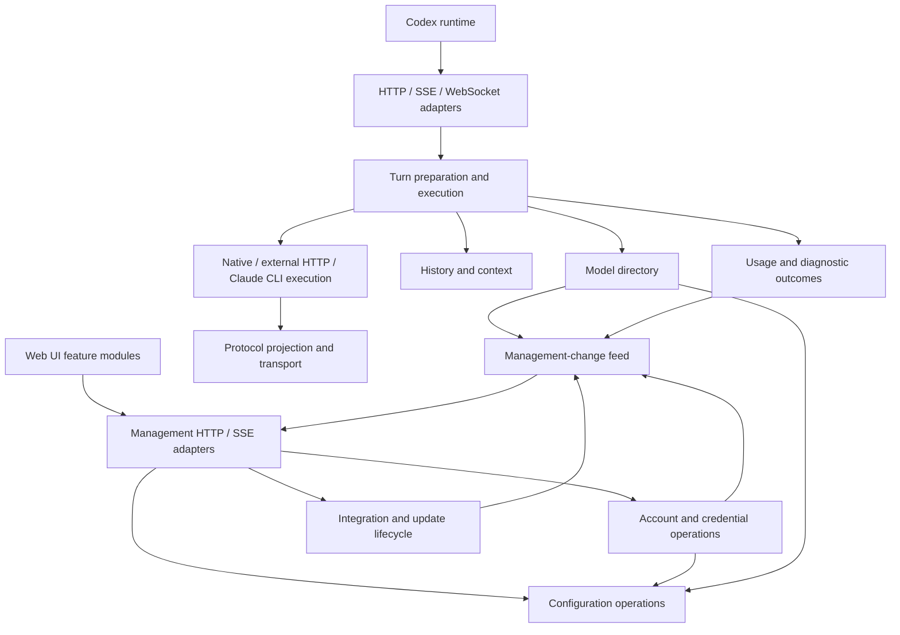

# Architecture assessment and refactoring direction

For the current whole-backend ownership contract, before/after diagrams and
acceptance checklist, see [Backend workflows](backend-workflows.md). The
assessment below records the earlier passes; availability gates, cooldowns and
recovery probes are outside the passive-observation refactor.

Assessment date: 2026-10-04. The findings describe the 0.12.9 source plus the
local profiling changes. The first ownership pass is implemented locally.
The continuation below deepens external request execution and error presentation.
This review traced application workflows and inspected all nine crate manifests;
it is not a line-by-line security audit or new cross-platform acceptance run.

## Decision

Redesign application ownership incrementally. Retain the existing protocol,
history, transport and integration implementations behind their useful
interfaces. A replacement of the entire backend is not justified by this review.

The main problem is knowledge shared across callers: handlers know credential
hydration, route selection, history preparation, configuration locking and
notification mechanics. Moving these functions into more files would leave
that problem intact. A successful refactor makes a caller know fewer rules.

The design reference is [Codebase Design](https://github.com/mattpocock/skills/tree/main/skills/engineering/codebase-design).
Use small interfaces that hide substantial behavior; test through those
interfaces. Evaluate an abstraction by what deleting it would force its callers
to implement. File length is a navigation signal, not a measure of module depth.

## Existing structure worth retaining

| Module | Existing responsibility | Decision |
| --- | --- | --- |
| `emp-core` | Route identities, bounded opaque model/provider data, capability views | Retain; preserve unknown fields |
| `emp-protocol` | Responses, Chat and Anthropic projections and stream state | Retain protocol-specific state machines |
| `emp-history` | History preparation, tool pairing, context and compaction algorithms | Retain the `HistoryReader` interface and pure algorithms |
| `emp-transport` | HTTP pools, proxy/TLS policy, admission, framing and WebSocket pump | Retain; profile resource ownership before changing execution model |
| `emp-router` | Protocol selection, projection and upstream execution | Retain; consolidate application attempt orchestration above it |
| `emp-codex` | Codex catalogs, concrete history access, quota helpers and runtime discovery | Retain concrete Codex integration; reduce application callers' knowledge of its storage details |
| `emp-integration` | Configuration leases, conflict detection and recovery | Retain transactional ownership |
| `emp-state` | Configuration, vault, transactions, plus update/usage/diagnostic subsystems | Narrow application access first; do not create new crates merely to redistribute files |
| `emp-app` | Composition, HTTP/UI, request orchestration and mutable services | Primary refactoring target |

No library crate depends on `emp-app`. The principal layering leaks are inside
the application, where most modules can access the complete `ServerState`.

## Findings

### 1. Request preparation and external attempts have explicit owners

[`api/responses.rs`](../crates/emp-app/src/api/responses.rs),
[`api/websocket.rs`](../crates/emp-app/src/api/websocket.rs) and
[`api/compact.rs`](../crates/emp-app/src/api/compact.rs) now use
[`request_preparation.rs`](../crates/emp-app/src/services/request_preparation.rs)
for one request-local configuration, credential hydration, route selection and
summary policy. History/context preparation and transport presentation remain
at their existing boundaries.

[`external.rs`](../crates/emp-app/src/services/external.rs) now owns complete
Responses execution and stream opening. The two operations share a private
attempt implementation: candidate selection, retry bounds/delay, context-error
feedback and retry receipts no longer live in the HTTP adapter. Complete
execution owns one outcome and its activity guard; an opened stream transfers
completion accounting to its existing relay. Optional disconnect monitoring
replaces the two previous opening wrappers and duplicated SSE caller branches.

Its interface returns the existing response/stream and typed failures. It does
not impose a new message schema on native or external data. Native forwarding,
external HTTP and Claude CLI execution remain concrete; Claude now returns its
completion directly, without a single-variant result wrapper. Initial request
preparation and the transport adapters still retain their actual responsibilities.

Preserve meaningful differences: compact does not currently apply auto-review
routing; WebSocket checks incremental-request scope before history replay;
protocol fallback must stop after output or tool side effects. Connection-local
WebSocket continuation stays in the WebSocket adapter. Share these operations
without replacing them with an oversized universal pipeline.

### 2. Configuration ownership leaks through raw locks

The original [`ConfigurationState`](../crates/emp-app/src/services/configuration.rs)
exposed its mutex from the provider forwarding module. The assessment found
direct configuration-lock access in 24 application source files, excluding
dedicated test files but including inline test code. This was a coupling signal,
not proof that 24 modules must change together.

Configuration publication is repeated in catalog edits, account operations,
quota status, protocol observations and context calibration. Callers must know
when to validate, persist, reload, release locks and notify other services.

The configuration module now owns a private mutex and durable commit/reload.
Readers receive snapshots or read-only guards; only services can acquire an
edit, and memory changes are published after commit succeeds. Settings commands
own validation and post-commit work; account import/removal/migration retain
credential locking and legacy-history settlement. HTTP handlers receive results
without orchestrating transactions. CLI listener overrides are an explicit,
non-persistent startup operation. Raw mutation is available only to test fixtures.

Preserve refresh-lock -> configuration-lock -> history-store-lock ordering,
transaction rollback and credential-rotation draining. A failed validation or
commit must not publish success. Keep flexible stored JSON and opaque upstream
fields; typed commands/results need not impose a closed schema on provider data.

### 3. Management events borrow the quota module's synchronization

Originally [`ActivityService`](../crates/emp-app/src/services/activity.rs)
required callers to supply the quota revision mutex and condition variable;
usage and runtime updates also borrowed it. The assessment found those wake
references in 14 application source files under the same counting rules as above.

This is already an event-driven wait with a keepalive deadline, not a repeated
quota fetch. The ownership and interface are the problem.

[`ManagementEvents`](../crates/emp-app/src/services/management_events.rs) now owns
the quota, activity, usage and integration revisions, subscriber limit and
shutdown wake. Activity and usage receive it at construction; request callers
no longer supply quota locks. Subscriptions check and wait under the publisher's
lock to prevent lost wakeups. SSE event names and snapshot behavior are unchanged.

State-change notices may coalesce: the consumer reads current state. Commands
that change accounts, consume a reset, install an update or request a scan must
retain a result or an accepted/running/completed/failed receipt. Waking a worker
does not prove command completion. Do not replace these distinct semantics
with a universal fire-and-forget bus. Quota deadlines remain scheduled work.

### 4. Model-directory operations own source collection and publication

[`catalog`](../crates/emp-app/src/services/catalog.rs) now owns public catalog
assembly, model lookup, subscription options, validation and selection commits.
Its private `CatalogSources` reads native data once per operation and account
credentials once, reusing those credentials for identity matching and duplicate
detection. Missing account caches reuse that operation's native fallback.
HTTP adapters no longer assemble catalog sources or publish configuration.

[`account_catalog`](../crates/emp-app/src/services/account_catalog.rs) retains
background refresh scheduling and identity-checked persistence. This is not a
long-lived response cache: external Codex catalog changes remain visible.
Further caching requires a complete invalidation rule for configuration,
credentials and external files. Measure before introducing that mechanism.

### 5. Workflow outcomes and wire rendering have explicit owners

[`RequestOutcome`](../crates/emp-app/src/services/request_outcome.rs) owns a
request's terminal result. It updates auto-review eligibility through
`ReviewState`, then submits content-free usage/diagnostic evidence. The
observation reporter no longer decides routing cooldowns or owns their locks.
Network evidence lives below the HTTP support-report adapter.

[`RequestObservation`](../crates/emp-app/src/services/observation/request.rs)
separately owns a client request's passive receipt, from entry through the last
downstream write. It receives only diagnostic storage, safe route facts, named
phases and write results; it has no routing, retry, account or usage controls.
HTTP Responses and Compact borrow the entry owner's receipt. Each WebSocket
turn owns a new receipt and an observed sender, linked to the connection receipt.
The same server-generated request ID links preparation, executor attempts,
existing model outcomes and downstream delivery. Early rejection also has a
receipt, even when no model outcome exists.

This separation matters when an upstream terminal event is received but writing
it to the client fails. `RequestOutcome` preserves the upstream result and its
single accounting entry; `RequestObservation` records the failed write. It does
not reinterpret success, update eligibility, replay output or switch sources.
The [journal contract](diagnostic-journal-spec.md#request-receipt-contract)
defines what each observation proves and the remaining unknowns.

Native complete/compact forwarding now returns the existing structured result
(status, raw body, content type and preserved headers). The native API renderer
formats HTTP bytes. History/context and external-compaction failures likewise
cross the service boundary as typed errors; their API adapter renders HTTP and
stream failure events. Original status codes, retry decisions and wire fields
remain part of the endpoint contract. Allocator page release is shared utility
policy, not a dependency on HTTP request parsing.

Application router and Claude failures are rendered by the API modules.
Claude execution retains public error classification for its accounting, while
HTTP and WebSocket presentation use that classification through the same small
interface. Subscription catalog refresh also returns a typed failure; its HTTP
adapter owns the status and JSON response. Generated SSE delivery belongs to
the streaming adapter. These execution modules no longer import API or HTTP
response helpers; the private Claude loopback relay still implements its own
HTTP transport as required.

Complete Responses JSON is converted by a pull-based iterator in `emp-router`.
Native and external JSON fallback, generated HTTP SSE, and Claude WebSocket
delivery request one event at a time. Each consumer writes before requesting
another event, so a blocked or closed downstream does not build the remaining
event sequence. Structural validation is separate from event generation; a
non-streaming Claude reply no longer generates and discards an SSE sequence.
The iterator validates the source once and yields events without imposing a
cumulative output-byte limit. Delivered bytes no longer occupy this iterator's
memory. A failed downstream write drops it, so the remaining events are never
constructed. No producer task or channel is needed for this synchronous path.
The complete source JSON, current event and encoded frame still require memory;
this does not impose a process-wide byte budget across admitted requests.

This follows the consumption model in Codex's `codex-api/src/sse/responses.rs`
(reference checkout `5b0b253035`, updated 2026-10-07): await bounded-channel sends and stop when the
receiver closes. EMP's writer supplies that backpressure directly. Ordinary
JSON body and retained protocol-state limits remain separate from event delivery.
Native SSE limits the event being parsed, rather than cumulative delivered bytes;
the ordinary JSON fallback still has its body limit. Declared SSE does not retain
a second copy of the received body. Native and external Responses stop at the
first terminal event, release upstream work and ignore trailing data, rather than
waiting for EOF or draining the socket. Unknown fields, `partial_answer`,
`end_turn` and interrupted-response metadata remain in the wire response.

### 6. Cancellation follows transport ownership

Native Responses WebSocket turns use a socket-readiness loop in
[`websocket/duplex.rs`](../crates/emp-app/src/api/websocket/duplex.rs).
It reads both directions on the connection's existing thread, including data
already buffered in TLS or frame decoding. It does not add a producer task,
periodic polling worker or upstream event queue. Reads drain available bytes in
nonblocking mode, then restore blocking mode before frame writes. Receive
timeouts are left unchanged; readiness registrations are removed at turn end.

Codex's `response.interrupt` is forwarded through the active upstream connection;
that upstream owns response-ID validation and acknowledgement. An incomplete
response with reason `interrupted` remains a valid incremental continuation base,
as in Codex's current Responses client, without being counted as successful
context calibration. A pipelined next request is held in one slot and re-enters
normal route/scope validation after the current terminal. Downstream closure
cancels a silent upstream. Once an incremental request receives an upstream
event, a broken connection is reported as an incomplete stream, not as a missing
previous response that instructs Codex to replay the request.

HTTP fallback, external HTTP streams and the single-step Claude CLI also accept
Codex's steering control (`response.interrupt`, `discard_partial_items`). During
these turns, a temporary readiness worker owns the existing frame decoder;
the output writer retains its connection, and complete frame writes are
serialized with control replies, pongs and temporary read-mode changes on cloned
TCP handles. The worker waits for socket events,
retains at most one next request, then returns the decoder, including buffered
or partial frames. It is joined before the next turn begins.

A matching active response ID cancels the owned upstream operation through the
existing cancellation signal. Further output is discarded, and EMP sends
`response.incomplete` with reason `interrupted`, the same response ID and
`end_turn: false`. Claude publishes its projected response ID before its buffered
inference so steering can cancel the CLI process tree and relay. Incorrect
targets are rejected; late interrupts for the preceding terminal are ignored.
These adapters have no resumable upstream WebSocket state: an incremental
continuation receives `previous_response_not_found`, allowing Codex to resend
full history; the client may switch to HTTP for that recovery. A `generate: false`
warmup returns an empty response ID because no resumable state exists. Codex then
sends the complete first request instead of referencing an invented checkpoint.
Native WebSocket continuations still use the upstream state. EMP does not invent
usage for cancelled inference.

Control frames are logged separately from model requests. Active interruption
uses `client_cancelled` and the call state `interrupted`; a disconnected client
retains its separate cancellation classification. This follows Codex's
2026-09-26 steering change (`12de0e395d`, PR #48508), without a new version gate
or setting.

Real Codex app-server tests drive `turn/start` and `turn/steer` through isolated
EMP servers and synthetic upstreams. Codex's own `instant_interrupt` feature and
the model's `use_responses_lite` capability determine whether it sends an
interrupt or drains the current response before applying steering. EMP does not
change those client settings. The tests also distinguish a Codex RPC rejection
for a wrong turn ID, which never reaches EMP, from EMP's request validation.

Typed errors generated by the router, history and Claude adapters carry an
`origin` and a readable source prefix: EMP validation/adaptation, upstream
service, connection, or Claude Code CLI.
CLI errors identify the observed CLI boundary; a CLI failure alone does not prove
whether its service rejected the request. Native upstream events remain intact.
The delivery receipt records `response_error` with request/connection IDs, phase,
error code, origin and local write result, without copying the error message or
request body. Upstream receipts take provenance from the receiving boundary,
ignoring any upstream `origin` claim. Unclassified errors stay `unknown`.
Call records retain origin and the separate downstream delivery facts in the
existing usage database. A local write result is not a client acknowledgement.

[`DisconnectMonitor`](../crates/emp-app/src/services/disconnect.rs) starts its
worker lazily and waits on interruptible socket readiness. Drop wakes and joins
the worker without detaching it or shutting down the shared downstream socket.
Queued bytes and the previous read timeout are preserved. A bounded peek remains
as a backstop after readiness; ordinary idle waits no longer depend on that timeout.
Linux cancellation and teardown contracts pass locally. Native package checks
also run the disconnect contracts on Windows, Linux and both macOS architectures.
See [profiling evidence](performance-profiling.md) for the local measurements.
Changing all HTTP handling to an async framework is a separate decision, not a
prerequisite for the ownership fix.

Claude's request-local relay uses socket readiness and a cancellation signal
shared with its async upstream operation. Cancellation wakes idle accept,
header/body reads and blocked writes; late subscribers observe the same signal.
One absolute deadline bounds each relay read/write operation. The CLI process
monitor retains its bounded exit polling. This does not change subscription
sampling schedules or introduce an application-wide event framework.

CLI-added date reminders are normalized at this same relay boundary for text
and multimodal requests. Only the observed fixed reminder format with a valid
calendar date can move into system metadata. User text, media order and tool
history still have to match the prepared transcript; an arbitrary extra block
or a modified transcript remains an error.

### 7. Frontend features own private state and explicit dependencies

The UI still consumes the same HTTP/SSE endpoints. `management-client.js` owns
session storage, bootstrap exchange, request authentication and API errors.
`settings.js`, `call-reports.js` and `diagnostics.js` own their feature
operations; request selection, diagnostics timers and late-response guards are
private. The page supplies current-state/language getters and UI operations.
A changed language or new configuration therefore does not leave a stale copy
inside a feature.

`report-query.js` owns cancellation and latest-result selection for usage and
call/performance queries. Its interface is `run`/`cancel` plus result/state
callbacks; callers do not coordinate request counters. Refresh failures retain
the displayed data. `period-controls.js` supplies the same presets, explicit
custom-date query and refresh behavior to all time-based views. `usage-report.js` now owns its payload, scan request, fallback timer and pricing
save lifecycle behind `open`/`refresh`/`stop`. It reads configuration and language
through getters and receives period controls explicitly. DOM actions stay inside
the report root instead of adding page-level usage handlers.
`account-details.js` owns account usage reads and alias interaction;
`model-editor.js` owns the model draft, capability edits and metadata cancellation.
`model-settings.js` owns cached/discovered lists. The page composes these owners
and calls their cleanup when replacing or closing a modal. Provider detail reads
also cancel on closure. Late query results, save errors and draft cleanup cannot
alter a replacement window. Configuration persistence, formatting policy and
model inference remain existing shared operations; they are not duplicated.
Performance navigation stays mounted during data refresh; overview metrics are
plain facts rather than six equivalent navigation buttons.

HTTP error serialization shares a status/body/retry-header function.
`api/failure_response/stream.rs` owns the common SSE/WebSocket error detail;
WebSocket does not allocate an SSE envelope to extract that detail. Native
pre-output conversion reuses the router's bounded Retry-After parser. Wire
contracts remain distinct and are exercised at the actual server interface.

Styles are embedded as a separate static asset in their original cascade order.
All assets ship in the EMP executable, with no new framework, development server
or frontend build pipeline. Existing page event handlers bind the features'
public operations. Account, provider, quota and model rendering remain in the
page and are future candidates for the same treatment; moving all functions to
another large script would not improve that boundary.

Behavioral checks exercise login expiration versus upstream authentication
errors, old bookmarks/cookie sessions, rejected settings, current activity
snapshots, diagnostics close/cancel behavior and the shipped script order.
The real server test also fetches the page's referenced assets before login.

#### Frontend development and acceptance

Frontend changes are reviewed in an interactive local **shadow frontend** before
integration into the running application. It serves the candidate UI on a separate
loopback origin and reads the running EMP's real management data. Preview edits
remain in that origin's private browser storage; they do not save production
configuration or execute account, inference, installer or lifecycle actions.
The bridge forwards only explicitly allowed read requests and reuses the existing
management session server-side, without exposing or rotating production credentials.
Creating this preview does not require rebuilding, installing or restarting EMP.

Retain the existing backend contracts and metric definitions. Check observable
behavior in English and Simplified Chinese, light/dark appearance and representative
window sizes and display scaling. Include real-data navigation, loading and refresh,
empty/error states, sparse charts, keyboard interaction, and modal close/cancellation.
Use one hover language across clickable controls: preserve their fills and text,
show a dotted wave around the outline, and use a small lift or icon enlargement.
Verify actual pointer hover and keyboard focus in both light and dark appearances,
including primary/secondary/danger buttons, selected controls and service icons.
Disabled controls stay inactive; reduced-motion preferences retain a static cue.
Confirm that preview edits leave production settings and the active runtime intact.
Do not run unrelated suites or paid inference to verify presentation changes.

Preserve the accepted Codex 5h unlimited presentation in both bar and ring modes:
when a completed quota query does not report a 5h limit, display `233%`, the fixed
text `1m111s`, and the multicolor flow effect. Keep these values unchanged when
switching between remaining and used views. They are presentation constants, not
measured quota or a real reset timestamp; do not write them into quota records,
trend history or accounting. Pending queries, failed queries and missing account
data must retain their own states, rather than being treated as unlimited. Include
this behavior in frontend acceptance for both modes, languages and themes.

Keep one intended preview process, remove task-created browser/test scratch after
verification, and record the preview location and results in the existing development
record. After each shadow frontend change is completed and accepted by Xian,
summarize the accepted changes and explicitly ask whether to migrate them into the
official frontend, unless Xian has already authorized that migration for the current
scope. Acceptance alone does not authorize integration, publishing or replacing the
running application. Once migration is authorized, use the shared presentation
modules, verify the official embedded assets and actual page, and explicitly report
whether the result is preview-only or included in the official frontend/release.

### 8. Service lifecycle owns its worker handles

`lifecycle.rs` holds background thread handles directly in a `Vec<JoinHandle<()>>`.
Only the server owner registers and joins them; workers receive shared application
state, never the handle list. One private spawn operation registers every successful
spawn. The previous shared mutex, four registration branches and unwrap/poison
failure paths are removed.

`lifecycle/startup.rs` assembles state and starts workers in the existing order.
The single-use session-construction wrapper and its copied options object are
removed. `lifecycle/connections.rs` owns accepting and admitting HTTP connections;
`services/quota/sampler.rs` owns quota deadlines and waits. Shutdown still closes
admission, restores integration, wakes and joins workers, then drains credential
operations and saves rotations. Quota sampling keeps its existing schedule and
condition-variable lock; this refactor introduces no event framework or new policy.
The duplicate health test is folded into the idle-listener shutdown contract with
both unauthenticated status/body assertions retained.

## Target ownership

This is a logical arrangement inside the existing executable, not a proposal
for separate services or one new crate per box.

The feed arrow back to management represents event delivery, not a source-level
dependency on the HTTP adapter. Composition injects the required references.
Command results still return directly or through operation receipts.

## Execution order and acceptance

1. **Turn resolution/preparation:** bring the repeated operation behind one
   interface; retain transport-specific error presentation and WebSocket state.
   Verify native/external HTTP and WebSocket routing, auto-review, unknown
   fields, history/tool pairing and compact's distinct routing policy using
   the existing endpoint fixtures.
2. **Cancellation:** validate interruptible teardown before further ownership
   changes, using the same isolated benchmark and cancellation contracts.
3. **Management-change feed:** remove cross-service access to quota locks.
   Verify wake-before-wait races, coalescing, shutdown and command receipts
   through existing management events and worker contracts.
4. **Configuration/account ownership:** privatize mutation and transaction
   mechanics. Verify concurrent import/refresh/migration, rejected edits,
   persistence failure and shutdown rotation. These failure cases remain
   valuable even when they require deterministic internal synchronization.
5. **Model-directory ownership:** unify source loading and publication, then
   measure whether a cached snapshot is worthwhile. Verify credential changes,
   external catalog changes, last-good retention, route selection and ETags.
6. **Transport-neutral outcomes:** relocate native/history/compaction response rendering and decouple
   telemetry from routing policy, retaining statuses, headers and terminal events.
7. **Frontend isolation:** extract one feature at a time with its actual data
   dependencies. Verify the affected interactions and unchanged wire contracts.

After these changes, reassess whether update/usage/diagnostics warrant separate
crates. Their current placement alone does not justify a new dependency layer.

Prefer existing observable contracts over additional helper tests. Remove a
test only when its asserted behavior is redundant or replaced at the owning
interface; retain security, concurrency, history and platform regression tests.
Dependency injection does not require a trait for every function. The existing
`HistoryReader`, HTTP client, integration manager and cancellable-await helper
earn their interfaces by concentrating real repeated work.

A private implementation change should normally need its module's tests and
the affected consumer contract. A public contract or lifecycle change still
needs its consumers checked. Modular design reduces that scope; it cannot
make cross-module behavior require no integration verification.

## Status of this local pass

The seven bounded ownership steps above are implemented and verified locally.
They do not mean every application module has been redesigned. Remaining page
features and the Responses adapter's compaction/Claude orchestration can be
evaluated in later work. They do not justify a new framework or splitting all
existing crates.

Acceptance: Linux workspace and focused endpoint/CLI/browser-behavior checks
passed; see [measured results and limitations](performance-profiling.md).
Two older tests needed their setup/expectation aligned with existing automatic
activation and explicit restoration behavior. Production startup/restore rules
were kept intact. No release or cross-platform execution is implied by this
local completion.

## Continuation: external execution (2026-10-04)

Status: implemented and verified locally. Existing uncommitted work is preserved.

Apply Codebase Design's deletion test and test through the same interface used
by callers. Preserve the existing working tree and the Codex-only runtime scope.
No new product features, plugin framework, crates or production deployment.

1. **Own external attempts.** Complete HTTP requests currently own protocol
   candidates, retries, delay, activity and completion accounting in their HTTP
   adapter. SSE and WebSocket openings repeat that policy in provider helpers.
   Give external execution two concrete operations: complete a response or open
   a stream. Keep the shared attempt loop private. Its interface returns the
   existing response/stream or a typed error; callers do not select retries.
2. **Separate error presentation.** Router and Claude execution return domain
   errors. HTTP/SSE/WebSocket adapters render them. Retain distinct pre-output
   HTTP errors and post-output terminal events, Retry-After, public redaction
   and the existing status/code/message contracts. Do not force different wire
   contracts into one lossy universal error structure.
3. **Remove obsolete surfaces.** Replace the two stream-opening wrappers and
   their duplicated caller branches with one optional cancellation input.
   Keep complete-response accounting separate from the lifetime of an opened
   stream. Relocate existing presentation tests to their owning module; add an
   endpoint regression only if existing contracts miss an affected behavior.
4. **Verify and record.** Run the affected external HTTP/SSE/WebSocket, retry,
   cancellation, history/compaction and Claude error contracts. Run formatting
   and strict application Clippy after the focused tests. Record outcomes here
   and in the existing local progress log. No CI, release or live-account tests.

Interface choice: a public generic turn pipeline would make every caller learn
operation variants, observer hooks and transport details. Concrete complete/open
operations hide those facts; a private attempt implementation can still share
policy. Native forwarding, Claude process execution and WebSocket continuation
remain concrete because their lifecycles and retry rules differ.

Dependency/test seam: use the existing HTTP client against loopback upstreams
and actual EMP endpoints. No new provider trait or test-only public interface
is needed. Acceptance concerns returned status/events, upstream request count
and path, cancellation, one usage receipt, and protocol observation persistence.

Results: 45 focused Linux contracts passed, followed by four installed-Claude
CLI contracts using temporary homes and synthetic loopback CPA responses. Two
local-login contracts remained ignored because they require their separate
host-egress setup. Strict application Clippy, formatting and diff checks passed.
No full workspace rerun, new performance claim or cross-platform result is
implied. The existing router wire renderers were preserved verbatim; one Claude
presentation test moved with its owner, and two catalog tests now assert the
typed refresh result. No extra helper tests or plugin abstractions were added.

## Continuation: implementation ablation (2026-10-08)

Status: implemented and verified locally, preserving the existing pending work.
This pass changes internal ownership only; it adds no product features and does
not deploy, publish a release or run CI.

| Owner | Responsibility hidden from callers | Removed duplication |
| --- | --- | --- |
| Claude process command policy | Isolated environment, platform setup and inference/auth/control arguments | Inference and control commands share one environment constructor |
| Claude process lifecycle | Bounded pipes, cancellation, timeout and child-tree cleanup | Removed the default-timeout forwarding function and quota-only forwarding function; quota requests belong to the quota query |
| Claude response projection | CLI result parsing, tool restoration and response usage | Request construction no longer contains response implementation or its tests |
| Claude relay transcript | Exact prepared-history comparison, permitted CLI metadata and tool carrier validation | Relay orchestration uses one validation result instead of knowing both validation steps |
| Router request policy | Model/route agreement, stream mode, supported dialect and reasoning-effort projection | Complete and stream execution share the same validation, retaining their different errors |
| Frontend call reports | Activity selection, call query, rendering and stale-response protection | Removed the request-details forwarding asset and its page aliases |

The Claude entry files went from 876/831/879 lines to 301/158/133 lines for
process/projection/relay respectively. Their private production children range
from 299 to 369 lines; existing tests moved to their owners without changing
the security assertions. The router entry went from 665 to 482 lines. File
movement is not counted as code deletion: the measured Rust/JS/HTML/CSS source
set decreased by 16 lines overall, excluding CommonJS test and documentation
changes. The useful reduction is fewer independent implementations and fewer
rules known by callers, rather than a large apparent deletion from moving code.

One forwarding-only frontend test was removed; account selection and merged
model-selection assertions now execute through the existing call-query test,
which also exercises event coalescing, filter changes and close-before-response.
Security, tool-pairing, environment-isolation and cancellation tests remain.
No public test seam, trait, crate or generic execution framework was introduced.

Acceptance: 55 Claude tests, 12 router library tests, seven external HTTP/stream
contracts and ten browser behavior contracts passed locally. Twelve existing
Claude integration tests requiring a separately configured installed CLI remain
ignored; they were not executed or removed. Two catalog tests needed permission
to bind their temporary loopback fixture ports after the sandbox denied binding;
both passed on rerun. Formatting, strict Clippy for the affected application and
router targets, and diff checks passed. No full workspace, live-account,
cross-platform or performance result is implied by this pass.

## Claude instruction priority and context ownership (2026-10-08)

Status: implemented locally without deploying, publishing or running CI.

The adapter now combines its tool-proposal bridge prompt with the Responses
`instructions` and top-level `system`/`developer` messages in the replacement
Claude system prompt. Those instructions are removed from the user carrier,
so they are not duplicated. User-provided AGENTS content and nested role fields
inside tool results stay at their original conversation position. Claude's
default system prompt is replaced; its tools, skills, MCP and project instructions
remain disabled. Codex executes the returned tool proposals.

The remaining ordered conversation and tool definitions still use one serialized
user carrier, with native media blocks for supported attachments. This change
does not implement native Claude assistant/tool-result messages for every Codex
history item. Input validation bounds the combined system prompt and carrier,
and context assessment and calibration now use the same prepared projection.

EMP owns the configured history budget and compaction. Every inference command
disables Claude Code's independent compaction and passes the requested output
limit, falling back to the model/provider output setting. It does not overwrite
Claude Code's physical model capacity with the user history budget: doing so
made an existing short-window conversation fail before any upstream request.
The unchanged short-window end-to-end contract passes with this separation.

The selected model retains its `[1m]` tag when invoking Claude Code. The private
CPA relay removes that tag from the API model ID and preserves the CLI's
extended-context protocol headers. This selects a supported capacity mode;
changing an EMP budget does not grant additional model/account capacity.

Acceptance: 58 focused Claude tests, six installed-CLI end-to-end contracts
against isolated fake CPA servers, and the router's Anthropic passthrough
contract passed. These cover actual system-prompt delivery, tool history,
images/documents, extended-context headers and bounded history compaction.
The six remaining opt-in contracts were not run. No real subscription, cloud
1M-token workload, full workspace or cross-platform result is implied.
Formatting, strict Clippy for the affected application/router targets and diff
checks also passed.

## Service detail ownership (2026-10-08)

Service badges now own information and editing navigation. Codex account dialogs
switch between account information and existing model settings; provider dialogs
switch between service information and existing connection settings. The list
keeps refresh, trend and provider model actions without a separate Edit button.
No account/provider identity or configuration-save contract changed.

`service-usage.js` renders lifetime summaries for both account and provider
dialogs. It combines the selected owner's existing usage groups by upstream
model ID, summing reported tokens and priced costs across dates and tiers.
Unknown usage remains unknown, and known zero-cost records remain zero.
The detailed Usage page and ledger retain their category/tier/time breakdowns.
Provider dialogs filter the owner before aggregation; stale dialog replies
remain discarded. This removes the duplicate rendering policy without changing
stored records or pricing.

The self-contained service preview was refreshed. Twelve frontend behavior
contracts passed, including badge navigation, owner isolation, model grouping,
partial usage and zero costs. The application build, formatting, strict Clippy
and diff checks passed locally. No CI, release or production restart occurred.
First-use onboarding is documented as a proposal, not implemented behavior.

### Installed CLI short-request verification (2026-10-09)

Claude Code 2.1.293 completed a real Haiku 5.5 low-effort request through an
isolated EMP using the configured CPA endpoint and authentication. With a 1024
output-token ceiling, the direct request finished in approximately 9.94 seconds:
1156 input tokens (1154 cached), 376 output tokens, and one correctly projected
Codex tool proposal. System instruction precedence was verified against a
conflicting user instruction. Production configuration and services were untouched.

The earlier 256-token ceiling exhausted the budget in thinking before any
structured proposal was produced. Upstream SSE included message_stop and the
stop reason max_tokens. Replaying that response locally reproduced the wait,
without another model call. That verification identified the missing output-budget
error path; the local fix is described below.

### Claude output-budget termination (2026-10-09)

The CPA relay recognizes Anthropic JSON/SSE stop reasons `max_tokens` and
`max_output_tokens` before delivering the response to Claude Code. Local-login
and media calls expose partial CLI events; their stdout reader recognizes the
same terminal reasons. Both paths cancel the owned CLI process and return
`claude_cli_output_budget_exhausted` through the existing response/error channel.
The configured output limit remains unchanged, and EMP does not retry inference.
The failure journal records the `output_budget` stage without response content.

Two focused parser/process contracts passed. An installed CLI contract against
an isolated fake CPA passed JSON and SSE responses, including streamed downstream
delivery, and asserted one upstream request with the original 256-token limit.
Two normal installed-CLI contracts also passed for tools, text and media.
These checks do not constitute a new real-provider or real-subscription test.

### Usage service hierarchy (2026-10-09)

The Usage window groups query results by Codex subscription, Claude Code/CPA
and API, then combines matching model IDs within each type. Expanding a model
shows the original service/account and tier rows. Removed or unknown providers
remain under Other records rather than being assigned a guessed type.
The shared service-usage renderer also retains owner-filtered lifetime summaries.
The ledger, time/source filters, pricing and chart queries are unchanged.
Thirteen frontend behavior contracts passed, including aggregation, service
classification, unknown fields, escaping and preservation of the query rows.
