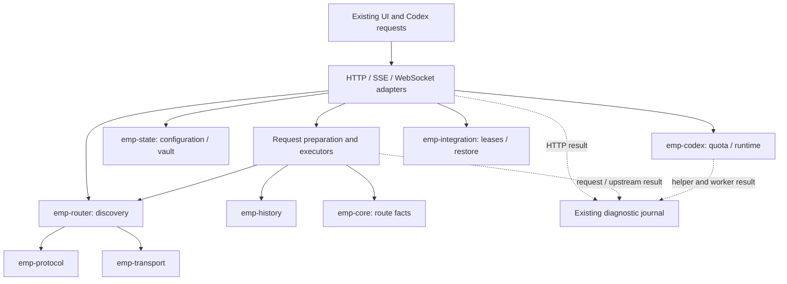
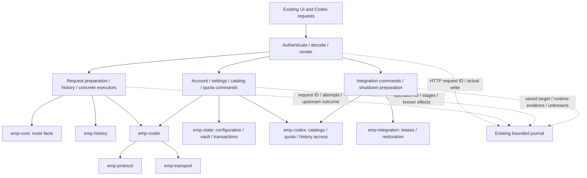

# Backend ownership: simple execution, complete evidence

[中文一页说明与前后对比](backend-workflows.zh-CN.md)

This is the current implementation contract for the eight library crates and
their composition in `emp-app`. It supersedes proposals to add availability
gates, cooldowns or recovery probes as part of this refactor. The existing UI,
routes, confirmations, source selection, retries and error contracts remain.

## Ownership of all eight modules

| Module | Owns | Application boundary / decision |
| --- | --- | --- |
| `emp-core` | Route identities, provider/model values and capabilities | Shared typed facts; retain opaque upstream fields. |
| `emp-state` | Configuration, vault, file transactions, usage and diagnostic storage | Configuration and account commands own writes; HTTP adapters do not hydrate credentials or coordinate transactions. |
| `emp-codex` | Concrete Codex history, catalogs, quota helpers and runtime observations | Catalog, account/quota and integration services own the complete user operation. |
| `emp-integration` | Configuration leases, conflict detection, restoration | Integration commands own apply/restore/search/runtime sequencing; the lease manager retains transactional authority. |
| `emp-history` | History/context preparation and compaction algorithms | Existing request preparation and history services retain ownership; preserve tool pairing and continuation behavior. |
| `emp-router` | Protocol selection, projection and upstream dispatch | Existing native/external/Claude executors retain retry and outcome decisions. Provider discovery now belongs to the catalog service. |
| `emp-protocol` | Responses/Chat/Anthropic projection and stream state | Keep the concrete protocol machines; do not impose one universal wire pipeline. |
| `emp-transport` | Connections, TLS/proxy policy, limits, framing and socket lifecycle | Executors use the existing transport; wire adapters own downstream delivery evidence. |

Crate dependency directions are unchanged. No library depends on `emp-app`. The useful
consolidation is complete-operation ownership in the application, not merging
independent protocol, persistence and transport implementations into one crate.

## Before / after

These are responsibility diagrams, not a complete crate dependency graph.
Solid arrows are execution; dotted arrows are passive evidence.

Before: model request services already existed, but management HTTP handlers
also knew locks, credentials, discovery, reset/read ordering, leases and runtime
steps. Results were recorded at different boundaries.

After: wire adapters authenticate, decode, call an operation owner and render
the existing response. The owner keeps execution order and returns its result.
Evidence reports what happened; it has no control arrow back into execution.

## Complete operations and evidence

| Operation owner | Forward execution | Evidence and limit |
| --- | --- | --- |
| `services/request_preparation`, native/external/Claude executors; wire adapters | Prepare selected route → prepare history → execute → deliver | One request ID; requested effort, selected source/model, attempts and errors. Upstream completion/accounting remains independent of local delivery. |
| `services/accounts` | Validate → serialize account → settle legacy history when needed → commit credentials/configuration → publish account result | Import/delete receipt, pseudonymous account, history and complete transaction stages. Failed public-result reading does not erase a successful commit. |
| `services/configuration/settings` | Validate → commit/reload → request existing downstream work | Saved state is separate from catalog publication and queued work. Usage scan command ID links to existing worker receipts. |
| `services/catalog/discovery` | Resolve provider/credentials → discover or read metadata → optionally commit selection/catalog | A discovery result does not imply a saved selection. Selection retains its config/catalog rollback transaction. |
| `services/catalog`, `services/account_catalog` | Publish local catalog; separately request existing subscription refresh / fetch and identity-check a subscription catalog | Requested work is not completed work. Source generation and pseudonym identify background outcomes; publication has its own result. No new polling or probes. |
| `services/migration` | After existing one-use export authorization: encrypt; or decode/decrypt → commit account bundle → publish catalog | Bundle commit and later catalog publication have separate receipts. Passwords and bundles never enter observation. |
| `services/quota/commands` | Validate account → hold existing account lock → read quota, or explicitly reset then read quota | Reset outcome (`reset`, no credit, nothing to reset, already redeemed) and follow-up read are separate. A failed follow-up read does not cause another reset. |
| `services/integration/commands` | Confirm as before → hold operation lock → apply/restore → search step → existing runtime observation → summary | Saved configuration target, observed catalog match/mismatch/unknown and unobservable routing/desktop effect remain separate. Existing rollback and stop-after-response policy is preserved. |
| `services/shutdown` | Check update and active-work constraints → restore owned integration → verify native configuration → return readiness | An applied or unresolved previous listener lease keeps EMP running. Readiness is not proof of process exit, client receipt or desktop recovery. HTTP/lifecycle owners perform delivery and stopping. |

Updates, usage scans, startup and shutdown workers retain their existing
phase/command receipts and lifecycle owners. Migration commands retain the existing
HTTP confirmation and account transaction owner. These are not silently folded into
a fire-and-forget event bus. Existing notification coalescing remains intact.

## Observation contract

`services/observation/operation` can access diagnostic storage only. Command
owners supply fixed stage/fact names, fixed values, numeric generations and
tri-state checks. It never receives config snapshots, credentials, request
bodies, model replies, paths or arbitrary upstream errors. Account identities
are pseudonymized. Each receipt records `operation_id`, the trusted HTTP
`request_id` when present, stages, checks, duration and outcome. Request IDs
come from the connection owner, never a caller-supplied header. Direct service
calls have no HTTP parent.

`completed` means the command returned success under its existing contract.
`checks` use `true` / `false` / `null` for match / mismatch / unobserved. Missing
checks have not been reached. A successful saved write does not prove runtime
load; a live model-list result does not prove routing or desktop restoration.
`client_effect` stays unknown; correlate the HTTP receipt for the local write.

An ignored failure remains a failed stage inside a completed command. Panics
leave an interrupted receipt during unwinding. Process death, rotation or a
disabled journal can leave gaps. Journal I/O failure never changes the command
result or repeats it. These limits are evidence boundaries, not new policies.

## Acceptance checklist

- [x] Eight library responsibilities and their application owners are mapped.
- [x] Discovery, integration, migration, quota and quit orchestration moved out of HTTP.
- [x] Account/configuration/catalog operations have passive stage receipts.
- [x] HTTP correlation, queued work, persisted state and observed effects are distinct.
- [x] No new network probes, scheduling policy, routing or retry decisions.
- [x] No public endpoint, response schema, UI sequence or confirmation changes.
- [x] Tests use temporary Codex homes; fault injection asserts its temporary path.

Verification is through the existing config, catalog, quota, account race,
integration, HTTP/SSE/WebSocket, native and Claude contract suites. New
`management_operation_contract` cases exercise committed configuration followed
by failed publication, early rejection/privacy, parent HTTP correlation and
applied configuration with unverified runtime. The observer's unavailable-log
test checks exact result preservation and single execution. Test fixtures do
not establish real-provider or real-desktop acceptance.
