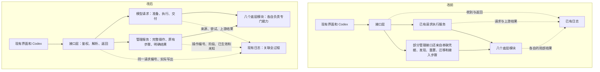

# EMP 后台改造：一页工作约定

**目标：做事的路径简单明确，检查结果的证据完整，保持现有使用逻辑。**

此次整理覆盖八个底层模块和 `emp-app` 的组织方式。重点合并重复职责、
让完整操作有明确负责人。账号选择、模型选择、按钮、确认、重试和恢复规则沿用原行为。
观测负责说明结果，不新增拦截、换源、重放或恢复探测。

## 前后对比

实线表示执行，虚线表示记录事实。

## 八个模块各管什么

| 模块 | 职责 |
| --- | --- |
| `emp-core` | 来源、模型和路由的共同定义 |
| `emp-state` | 配置、凭据存储、事务、用量和日志存储 |
| `emp-codex` | Codex 目录、历史读取、额度辅助进程和运行状态 |
| `emp-integration` | 接入配置的占用关系、冲突判断和恢复 |
| `emp-history` | 历史整理、上下文和压缩算法 |
| `emp-router` | 协议选择、上游调用和模型发现 |
| `emp-protocol` | 不同模型协议的格式转换和流式状态 |
| `emp-transport` | 连接、代理、TLS、传输限制和收发 |

`emp-app` 中的操作服务负责把这些能力按原有顺序组织起来。
接口层不再亲自串联发现、额度重置、迁移、接入恢复和退出步骤。

## 每次操作应能回答

1. **要求做什么？** 操作名、选定来源和模型；不记录会话正文和凭据。
2. **实际做到哪一步？** 各阶段、耗时、结果，以及原有执行器实际尝试情况。
3. **什么已经生效？** 配置提交、目录发布、运行目录观测分别记录。
4. **什么仍不能确定？** 未执行的检查和不能观测的客户端效果明确保留未知。

例如：“偏好已保存，但目录写入失败”会同时保留这两个事实；
“重置返回无可用权益”不会被记录成已消耗权益；
“Codex 模型目录吻合”不能推导出请求路由或桌面恢复也已验证。
检测结果只进入记录，不反过来改变业务动作。

## 完成依据

- 请求观测与管理操作观测都归入整体架构，使用 HTTP 请求编号关联。
- 账号、配置、目录、额度、迁移、接入和退出都有明确操作负责人。
- 原有异步任务继续区分“已请求”和“已完成”。
- 验收检查成功、局部失败、未知、日志故障和原有接口行为。
- 本地模拟和 CI 通过不等于真实账号、桌面环境已验收。

[开发者职责与验收说明](backend-workflows.md) · [日志字段约定](diagnostic-journal-spec.md)
